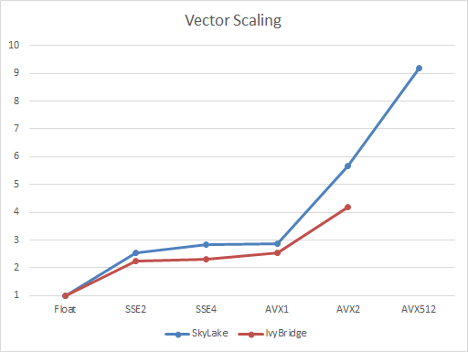
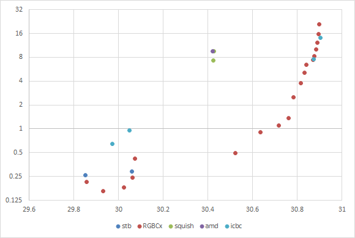

# ICBC - A High Quality SIMD BC1 Encoder
This is the BC1 texture block encoder used by [NVTT](https://github.com/castano/nvidia-texture-tools), extracted as an easy to use single header file library.

Since its initial release I've improved quality and performance. I've added support for multiple quality levels that allow reducing compression time at the cost of some quality, and I've vectorized some of the algorithms to take advantage of the vector units in modern CPUs.

This work was inspired by Rich Geldreich's [RGBCX](https://github.com/richgel999/bc7enc/blob/master/rgbcx.h), which is a close competitor and most likely a better choice if you are looking for a well supported and actively developed library.

## Results

The following chart shows the average PSNR of different BC1 compressors and different configurations on the [Kodim](http://r0k.us/graphics/kodak/) and [Waterloo](http://links.uwaterloo.ca/Repository.html) image sets plotted against the time it took to encode them:

- ICBC is version 1.03 with `three_color_mode` and `three_color_black` set to `true`.
- RGBCx is version 1.12 levels 0 to 18 with `allow_3color` and `use_transparent_texels_for_black` enabled.
- stb is stb_dxt version 1.09 with various improvements that Rich and I have proposed.
- squish is version 1.15
- CMP is AMD's CMP_Core V4.0.4855

## References

ICBC implements several algorithms: 

- Fast DXT encoding using box fitting as described in: [Real-Time-YCoCg-DXT-Compression](https://developer.download.nvidia.com/whitepapers/2007/Real-Time-YCoCg-DXT-Compression/Real-Time%20YCoCg-DXT%20Compression.pdf)
- Least squares endpoint optimization as in stb_dxt: https://github.com/nothings/stb/blob/master/stb_dxt.h
- Least squares optimization of all cluster combinations that preserve the order along the principal direction as in squish: http://sjbrown.co.uk/2006/01/19/dxt-compression-techniques/
- Iterative end-point refinement along the lines of the algorithm described by clooom: http://cbloomrants.blogspot.com/2008/12/12-08-08-dxtc-summary.html
- Fast least squares evaluation using summed area tables as in rgbcx: https://github.com/richgel999/bc7enc/blob/master/rgbcx.h

