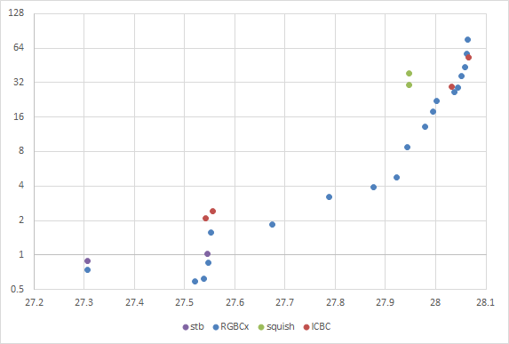

# ICBC - A High Quality BC1 Encoder
This is the BC1 texture block encoder used by [NVTT](https://github.com/castano/nvidia-texture-tools), extracted as an easy to use single header file library.

It implements several algorithms: 

- Fast DXT encoding using box fitting as described in: [Real-Time-YCoCg-DXT-Compression](https://developer.download.nvidia.com/whitepapers/2007/Real-Time-YCoCg-DXT-Compression/Real-Time%20YCoCg-DXT%20Compression.pdf)
- Least squares endpoint optimization as in stb_dxt: https://github.com/nothings/stb/blob/master/stb_dxt.h
- Exhaustive cluster fit evaluation as in squish: http://sjbrown.co.uk/2006/01/19/dxt-compression-techniques/
- Iterative end-point refinement along the lines of the algorithm described by clooom: http://cbloomrants.blogspot.com/2008/12/12-08-08-dxtc-summary.html

There are also some experimental algorithms that are not enabled:

- Exhaustive cluster fit with pre-computed factors for every cluster configuration. As in [High Quality DXT Compression using CUDA](https://developer.download.nvidia.com/compute/cuda/1.1-Beta/x86_website/projects/dxtc/doc/cuda_dxtc.pdf)
- K-means cluster fit.

Even though NVTT contained some fast compressors, these were not particularly optimized. The focus was on producing very high quality textures, and for a long time this was the highest quality open-source compressor available.

Today it has been superseded by Rich Geldreich's [RGBCX](https://github.com/richgel999/bc7enc/blob/master/rgbcx.h) library, which I hope becomes a suitable replacement for this code in almost all scenarios.

## Results

The following chart shows the average PSNR results of different BC1 compressors on the Kodim and Waterloo image sets.

- stb is stb_dxt version 1.09 with various improvements that Rich and I have proposed.
- RGBCx is version 1.12 with `allow_3color` and `use_transparent_texels_for_black` enabled.
- squish is version 1.15
- amd is AMD's CMP_Core V3.2.4691
- ICBC is version 1.0 compiled with SSE2 support and `ICBC_FAST_CLUSTER_FIT` enabled.

This other chart shows similar results, on a texture set from my employer:

